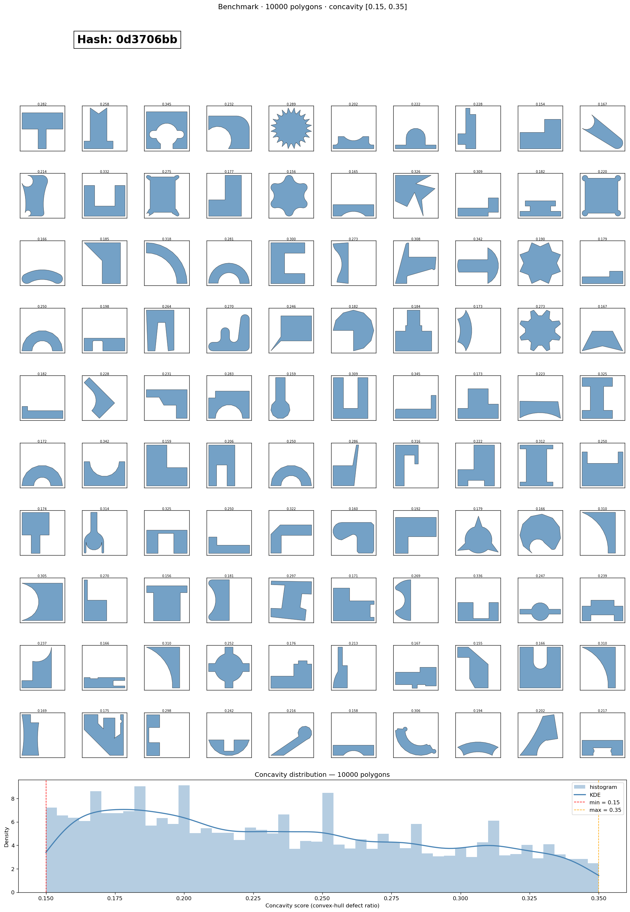

# SketchGraphs dataset builder
Extracts a filtered polygon dataset from the [SketchGraphs](https://sketchgraphs.cs.princeton.edu/) CAD sketch archive and saves it as an annotated JSON file.

## Usage

```bash
pip install numpy scipy pydantic lz4 tqdm matplotlib
python dataset_builder_standalone.py
```

Run it from any directory. Outputs are written to `sketch_graphs_dataset/` relative to wherever the script is called from:

```
sketch_graphs_dataset/
├── sg_all.npy                      # raw SketchGraphs archive (auto-downloaded, ~15 GB)
├── sketch_polygons_annotated.json  # filtered polygon annotations
└── sketch_polygons_preview.png     # 10×10 polygon grid + score distribution
```

`sg_all.npy` is only downloaded once. Subsequent runs reuse it.

## Dependencies

| Package | Why it's needed |
|---|---|
| `numpy` | Array operations and `.npy` file parsing |
| `scipy` | Convex hull area (`ConvexHull`) and KDE for the visualization |
| `pydantic` | Data validation and JSON serialisation of polygon models |
| `lz4` | Decompressing individual sketches from the `.npy` binary format |
| `tqdm` | Progress bars during download and polygon collection |
| `matplotlib` | Preview PNG (polygon grid + concavity score distribution) |

All other imports (`enum`, `hashlib`, `io`, `json`, `math`, `pickle`, `random`, `urllib`) are Python standard library.

## What the script does

1. Downloads `sg_all.npy` from the SketchGraphs server if not already present.
2. Parses the nested binary format directly — no SketchGraphs library required.
3. Shuffles sketch indices with a fixed seed for reproducibility.
4. For each sketch, extracts line and arc segments and attempts to reconstruct a single closed polygon loop.
5. Applies the following filters in order, discarding shapes that fail:
   - **Self-intersecting** — edges cross each other
   - **Convex** — no reflex angles
   - **Concavity score out of range** — convex-hull defect ratio outside `[0.15, 0.35]`
   - **Too small** — covers less than 20 % of the normalised `[-1, 1]²` bounding box
6. Stops as soon as 10 000 valid polygons are collected.
7. Saves the annotated JSON and a preview PNG.

## Configuration

All tuneable parameters are constants at the top of `dataset_builder.py`:

| Constant | Default | Description |
|---|---|---|
| `TARGET_COUNT` | `10_000` | Number of polygons to collect |
| `CONCAVITY_MIN` | `0.15` | Minimum convex-hull defect ratio |
| `CONCAVITY_MAX` | `0.35` | Maximum convex-hull defect ratio |
| `MIN_AREA_FRACTION` | `0.20` | Minimum polygon area as a fraction of the `[-1, 1]²` box |
| `SEED` | `1200` | Random seed for reproducibility |
| `SNAP_DECIMALS` | `4` | Decimal places for endpoint snapping when matching arc/line junctions |


